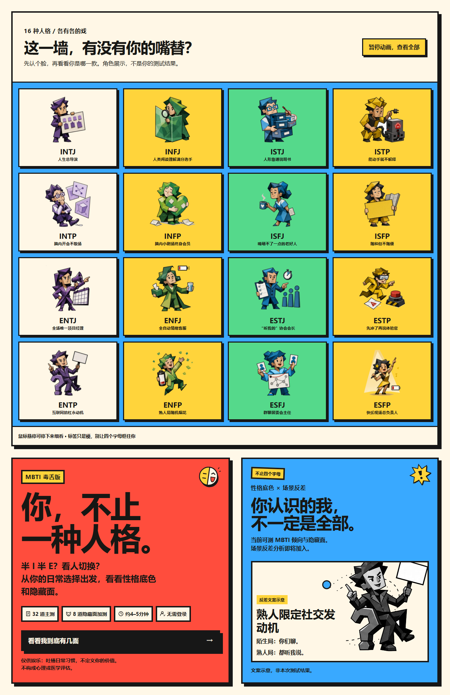
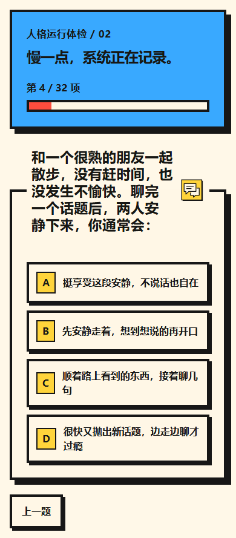
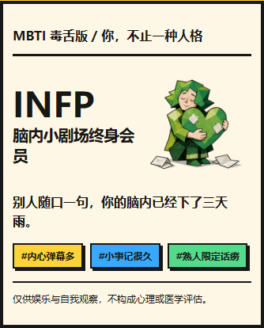

# MBTI 毒舌版 · 你，不止一种人格

**一个从产品构想到公开上线的 AI 辅助开发（Vibe Coding）个人项目。**

把娱乐人格测试做成可体验、可分享的网页：32 道主测、8 道可选隐藏面加测、16 个人格角色和带标签的分享卡。重点不是“让 AI 写一个页面”，而是持续完成需求取舍、体验验收、问题定位与发布验证。

[在线体验](https://bushibohai.github.io/mbti-toxic-test/) · [完整开发流程](docs/PROCESS.md) · [技术与取舍](docs/ARCHITECTURE.md) · [验证与迭代证据](docs/VALIDATION.md) · [简历与面试材料](docs/RESUME.md)

> 仅供娱乐与自我观察，不是官方 MBTI 测评，不构成心理或医学评估。AI 用于开发协作；在线测试使用本地规则评分，不调用大模型分析用户答案。

## 30 秒了解项目

| 项目要素 | 说明 |
| --- | --- |
| 作者 | 海哥AI不打烊 / [bushibohai](https://github.com/bushibohai) |
| 人工负责 | 产品定位、功能优先级、视觉方向、题目与文案反馈、体验验收、发布决策 |
| AI 协作 | Codex 辅助方案细化、代码实现、测试、排查、静态打包与部署 |
| 已上线 | 无需登录的测试、隐藏面邀请、人格卡预览与 PNG 下载、网站链接复制 |
| 技术 | React、TypeScript、Vite 静态构建、CSS/SVG、Canvas、GitHub Pages |
| 原始工程 | React + Next.js；线上版本复用前端逻辑，经独立 Vite 入口构建 |
| 当前边界 | 后端分享记录与数据分析没有部署；没有可对外宣称的用户增长指标 |

## 产品体验



<p>
  
  
</p>

截图来自实际线上页面。人格卡使用自动化固定答案生成，仅展示 UI，不代表作者或真实用户的测评结果。首页截图开启了减少动态效果，在线默认支持漂移和悬停暂停。

## 做了什么

- **测试闭环**：每题 ABCD 四选一；32 道主测完成即可查看与分享，不必先做隐藏面。
- **自愿加测**：结果页弹窗邀请继续 8 道隐藏面测试，可跳过；完成后展示公开面与隐藏面。
- **不只四个字母**：结果保留类型，同时呈现四维倾向与强弱，避免把娱乐标签当成完整的人格定义。
- **可分享结果**：16 个专属角色、人格称号、一句话描述与 3 个标签；支持方形及竖版 PNG。
- **一致的视觉语言**：Neo-Brutalism 粗描边、硬阴影、高对比色；角色墙漂移、悬停反馈和题目 SVG 图案。
- **移动端加载迭代**：在线 HTML、脚本和图片拆分；加载/失败提示、重试入口与渲染错误兜底。

分享网站链接只邀请朋友重新测试，不携带个人结果。图片需要用户保存或长按保存，**不会自动写入手机相册**。

## 值得讲的三个决策

1. **先交付主测价值，再邀请加测**：把“32＋8 必须全部完成”调整为“32 题出结果＋自愿加测”，这是降低路径负担的产品假设，尚无转化率数据证明效果。
2. **在线版与单文件下载版分离**：首次把图片全部嵌入 HTML，手机反馈白屏；随后改用约 2.2 KB 的入口 HTML 与独立压缩素材，不再让全部图片下载阻塞启动。
3. **不只修措辞，还检查题目重复**：第 4 题先从“陌生城市”改为活动社交，又因与其他社交题重复，最终改成“和熟人散步时的安静与互动偏好”。

更多决策背景、失败尝试与验收方法见 [开发复盘](docs/PROCESS.md)。

## 仓库内容与本地预览

**这是公开展示与静态部署仓库，不是完整开发源码仓库。** 不包含原始 React/TypeScript 源码、测试源码、数据库配置、密钥或逐题答题数据；编译后的浏览器代码位于 `assets/`。

```text
index.html           轻量入口、加载与失败提示
assets/              编译后的 JavaScript / CSS
characters/          16 张压缩 WebP 人物素材
docs/                开发复盘、技术说明、验证与简历材料
.nojekyll            GitHub Pages 静态发布标记
```

克隆后，用任意静态 HTTP 服务预览。例如已安装 Python 时：

```bash
git clone https://github.com/bushibohai/mbti-toxic-test.git
cd mbti-toxic-test
python -m http.server 8080
```

打开 `http://localhost:8080/`。此仓库无需 `npm install`，也不能直接运行原工程的测试或重新编译源码。不要通过双击在线版 `index.html` 验证模块脚本；单文件离线版是另一个本地产物。

## 验证与限制

- 原始本地工程最近一次记录：**24 个测试文件、427 项测试通过**；包括未部署的后端模块测试，不等同 427 项线上验收。
- 静态版已检查完整答题、图片导出、刷新回首页，以及脚本/图片加载异常；详见 [验证范围](docs/VALIDATION.md)。
- 真实手机仍需持续验收。Windows WebKit 测试不是实际 iPhone 测试，线上图片加载曾出现不稳定。
- 消费人格、网络人格、旅行人格仅为“即将开放”入口；场景反差分析、服务端统计与持久化分享尚未上线。

## 下一步

优先完善真实手机兼容性与题库质量，再评估隐私友好的行为统计和专题加测。路线图与指标定义见 [验证与后续计划](docs/VALIDATION.md#后续计划未上线)。不以“即将开放”或本地实现代替上线成果。

## 素材说明

角色视觉在 AI 协作过程中形成；角色墙按用户提供的 React Bits DriftWall 效果进行 CSS 适配。项目未在此宣称素材独占权，也未为整个仓库授予开放许可；商业使用或复用前需另行核查相关素材和依赖的许可。
